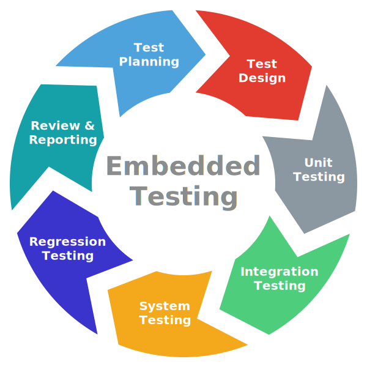

# Awesome Embedded Testing 

> Tools, frameworks, and resources for testing embedded and low-level software, covering unit testing, mocking, hardware simulation, static and dynamic analysis, continuous integration, and hardware-in-the-loop automation.

  

## Contents

- [Test Frameworks](#test-frameworks)
  - [Rust Test Frameworks](#rust-test-frameworks)
  - [General Embedded Testing Frameworks](#general-embedded-testing-frameworks)
  - [Mocking and Hardware Simulation](#mocking-and-hardware-simulation)
  - [Continuous Integration](#continuous-integration)
  - [Static and Dynamic Analysis](#static-and-dynamic-analysis)
  - [Embedded-Specific Techniques and Tools](#embedded-specific-techniques-and-tools)
  - [Test Automation and Hardware-in-the-Loop](#test-automation-and-hardware-in-the-loop)
  - [Examples and Reference Projects](#examples-and-reference-projects)

## Test Frameworks

### Rust Test Frameworks

- [embedded-test](https://crates.io/crates/embedded-test) - Rust test harness and runner for embedded devices.
- [defmt-test](https://github.com/knurling-rs/defmt/tree/main/firmware/defmt-test) - Rust test harness that lets you write and run unit tests on your device as if using the built-in `#[test]` attribute.

### General Embedded Testing Frameworks

- [Ceedling/Unity](https://github.com/ThrowTheSwitch/Ceedling) - Popular C-based unit testing and build framework, great for small to medium-sized embedded projects.
- [GoogleTest](https://github.com/google/googletest) - Widely used and highly customizable C++ testing framework, commonly adopted in embedded C++ projects.
- [CppUTest](https://github.com/cpputest/cpputest) - C and C++ testing framework tailored specifically to embedded software, emphasizing memory safety and simplicity.
- [Catch2](https://github.com/catchorg/Catch2) - Modern C++ testing framework known for ease of use and expressive assertions, lightweight enough for embedded targets.

### Mocking and Hardware Simulation

- [CMock](https://github.com/ThrowTheSwitch/CMock) - Generates mock objects automatically for C, ideal for testing interactions with hardware-dependent code.
- [Fake Function Framework (FFF)](https://github.com/meekrosoft/fff) - Lightweight, simple mocking framework for C-based embedded software.
- [Renode](https://github.com/renode/renode) - Multi-architecture framework for hardware simulation and testing, allowing execution and debugging of embedded binaries without actual hardware.
- [QEMU](https://github.com/qemu/qemu) - Widely adopted open-source emulator, very useful for full-system simulation of embedded platforms during testing.
- [embedded-hal-mock](https://github.com/dbrgn/embedded-hal-mock) - Mocks for testing Rust embedded-hal based drivers without hardware access.

### Continuous Integration

- [PlatformIO](https://github.com/platformio/platformio-core) - Cross-platform build tool and package manager, ideal for automating builds and tests for embedded projects.
- [Embench](https://github.com/embench/embench-iot) - Open-source benchmarking suite specifically targeting IoT-class embedded systems.
- [Robot Framework](https://github.com/robotframework/robotframework) - Generic Python-based acceptance-test automation framework, commonly used for higher-level integration and system tests.

### Static and Dynamic Analysis

- [Cppcheck](https://github.com/danmar/cppcheck) - Popular static analysis tool specifically tailored for C and C++ codebases.
- [Valgrind](https://valgrind.org) - Dynamic analysis tool useful for memory leak detection and error tracking.
- [Clang Sanitizers](https://github.com/google/sanitizers) - Effective runtime debugging tools for detecting memory safety errors in embedded C and C++ applications.

### Embedded-Specific Techniques and Tools

- [Embedded Artistry's Embedded Resources](https://github.com/embeddedartistry/embedded-resources) - Curated resources and examples for best practices in embedded software testing.
- [Tracealyzer](https://github.com/Percepio) - Real-time trace visualization for debugging and performance analysis of embedded systems (commercial with free tiers).

### Test Automation and Hardware-in-the-Loop

- [Labgrid](https://github.com/labgrid-project/labgrid) - Python-based automation framework for hardware-in-the-loop testing, integrates smoothly with continuous integration.
- [OpenHTF](https://github.com/google/openhtf) - Python hardware testing framework from Google designed for automated manufacturing tests and hardware-in-the-loop testing.
- [OnMCU](https://github.com/onmcu/onmcu-rs) - CLI for remote MCU development, flashing, and testing on real hardware hosted on the OnMCU platform.

### Examples and Reference Projects

- [NASA JPL's F Prime](https://github.com/nasa/fprime) - NASA's open-source C++ flight software framework, extensively tested and validated.
- [LVGL](https://github.com/lvgl/lvgl) - Embedded GUI library written in C, extensively using unit tests and automated integration testing.
